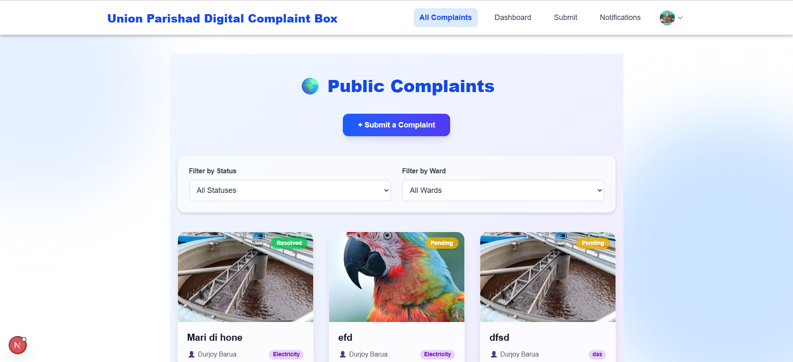
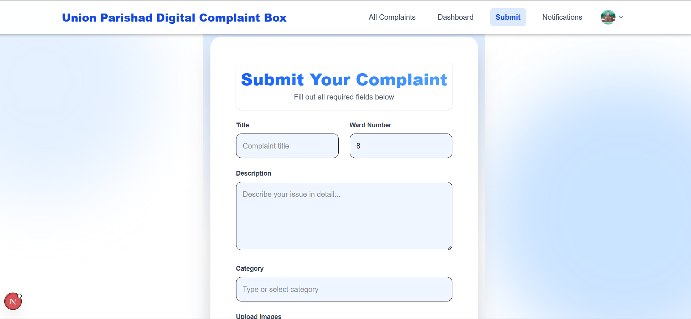
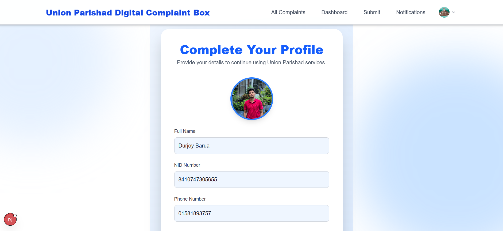
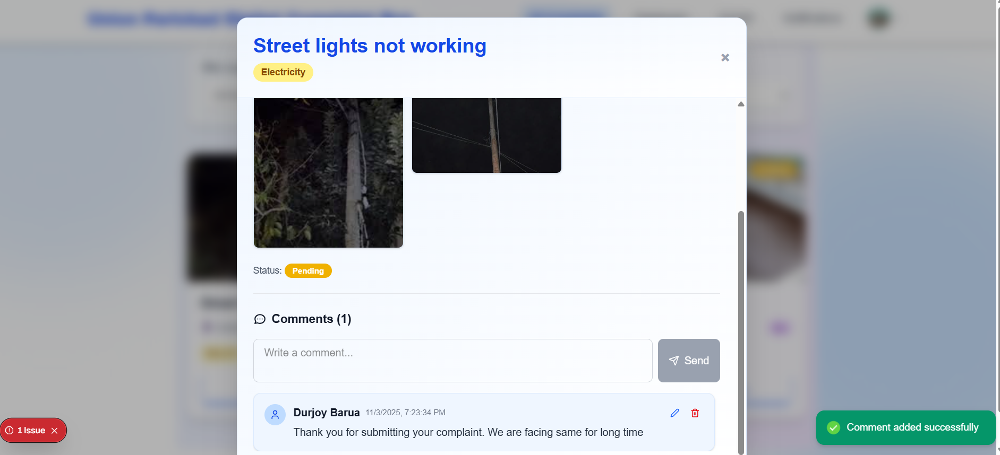
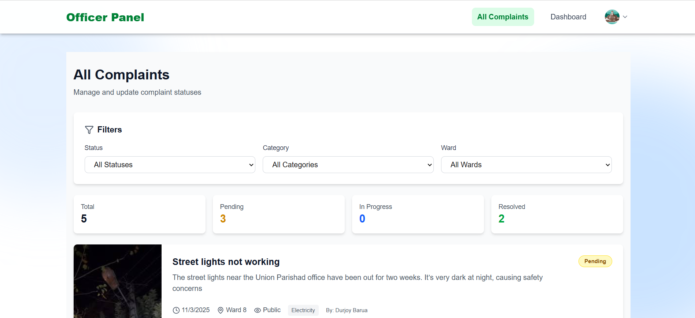
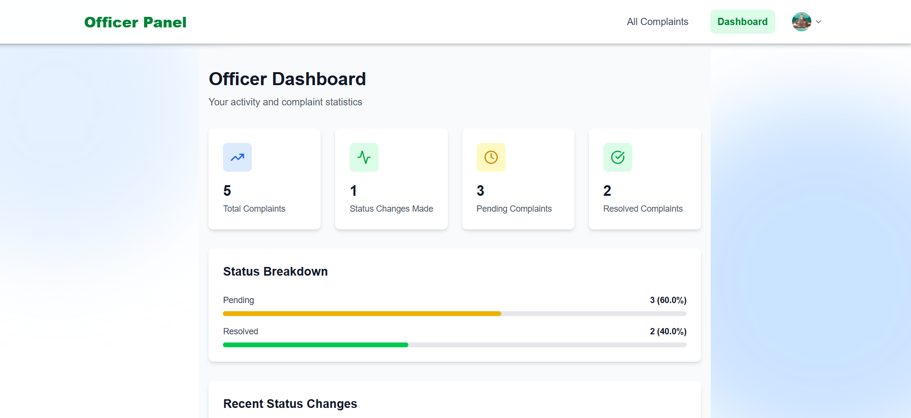
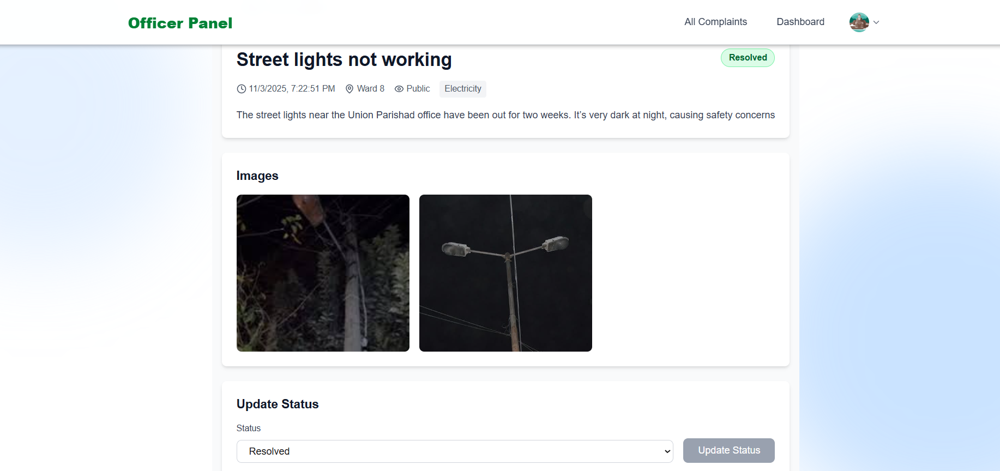

# 🏛️ Union Parishad Digital Complaint Box
<div align="center">
    <h3>Project Demo</h3>
<div style="display: grid; grid-template-columns: repeat(3, 1fr); gap: 10px; margin: 20px 0;">
    
    
    
    
    
    
    
</div>
</div>


A **full-stack web application** designed to digitize and streamline the citizen complaint process at the **Union Parishad** (local government) level in Bangladesh.  
This project allows citizens to submit complaints digitally, track their status, and enables Union Parishad officials to manage, review, and resolve complaints efficiently.

---

## 🚀 Project Overview

The system is divided into two parts:

1. **Backend (`union-parishad-digital-complaint-box-backend`)**
   - Built with **Express.js**, **MySQL**, and **Clerk Authentication**
   - Handles complaint submissions, user authentication, and file uploads.
   
2. **Frontend (`frontend`)**
   - Built with **Next.js (v16)**, **React (v19)**, and **Tailwind CSS (v4)**
   - Provides a modern, responsive UI for citizens and officials.

---

## 🗂️ Folder Structure

```
project-root/
├── backend/
│   ├── src/
│   │   └── index.js
│   ├── server.js
│   ├── .env
│   ├── package.json
│   └── README.md (this file)
└── frontend/
    ├── app/
    ├── components/
    ├── pages/
    ├── public/
    ├── styles/
    ├── package.json
    └── README.md
```

---

## ⚙️ Backend Setup (`union-parishad-digital-complaint-box-backend`)

### 🧩 Features
- User Authentication with **Clerk**
- Secure complaint submission
- File upload support using **Multer**
- MySQL database integration with **mysql2**
- Environment variables managed by **dotenv**
- CORS-enabled Express API

### 📦 Dependencies
```json
"express": "^4.21.2",
"mysql2": "^3.15.3",
"@clerk/express": "^1.7.43",
"@clerk/clerk-sdk-node": "^4.13.23",
"body-parser": "^2.2.0",
"dotenv": "^16.6.1",
"cors": "^2.8.5",
"multer": "^1.4.5-lts.1"
```

### 🧰 Optional Dependencies
```json
"bcryptjs": "^2.4.3",
"jsonwebtoken": "^9.0.0"
```

### 🧑‍💻 Dev Dependencies
```json
"nodemon": "^3.1.10"
```

### 🔧 Setup Instructions

1. **Clone the Repository**
   ```bash
   git clone https://github.com/your-username/union-parishad-digital-complaint-box.git
   cd union-parishad-digital-complaint-box/backend
   ```

2. **Install Dependencies**
   ```bash
   npm install
   ```

3. **Create `.env` File**
   ```bash
   PORT=5000
   DATABASE_HOST=localhost
   DATABASE_USER=root
   DATABASE_PASSWORD=yourpassword
   DATABASE_NAME=complaint_box
   CLERK_SECRET_KEY=your_clerk_secret_key
   ```

4. **Run the Server**
   ```bash
   npm run dev
   ```
   Or for production:
   ```bash
   npm start
   ```

5. **Server will start at:**
   ```
   http://localhost:5000
   ```

---

## 💻 Frontend Setup (`frontend`)

### 🧩 Features
- Built with **Next.js 16** and **React 19**
- Authentication using **Clerk for Next.js**
- Elegant UI with **Tailwind CSS 4**
- Toast notifications using **React Hot Toast**
- Modern icons with **Lucide React**

### 📦 Dependencies
```json
"@clerk/nextjs": "^6.34.1",
"lucide-react": "^0.552.0",
"next": "16.0.1",
"react": "19.2.0",
"react-dom": "19.2.0",
"react-hot-toast": "^2.6.0"
```

### 🧰 Dev Dependencies
```json
"tailwindcss": "^4",
"@tailwindcss/postcss": "^4",
"babel-plugin-react-compiler": "1.0.0"
```

### 🔧 Setup Instructions

1. **Navigate to Frontend Folder**
   ```bash
   cd ../frontend
   ```

2. **Install Dependencies**
   ```bash
   npm install
   ```

3. **Create `.env.local` File**
   ```bash
   NEXT_PUBLIC_CLERK_PUBLISHABLE_KEY=your_clerk_publishable_key
   NEXT_PUBLIC_API_URL=http://localhost:5000
   ```

4. **Run the Frontend**
   ```bash
   npm run dev
   ```

5. **Frontend will start at:**
   ```
   http://localhost:3000
   ```

---

## 🗃️ Database Setup

1. Create a MySQL database named `complaint_box`.
2. Example SQL structure (simplified):

```sql
CREATE TABLE complaints (
  id INT AUTO_INCREMENT PRIMARY KEY,
  name VARCHAR(100),
  contact VARCHAR(50),
  description TEXT,
  status ENUM('Pending', 'Reviewed', 'Resolved') DEFAULT 'Pending',
  file_path VARCHAR(255),
  created_at TIMESTAMP DEFAULT CURRENT_TIMESTAMP
);
```

---

## 🔒 Authentication (Clerk)

This project uses **Clerk** for authentication in both backend and frontend.

- **Frontend:** via `@clerk/nextjs`
- **Backend:** via `@clerk/express` middleware

For setup, visit: [https://clerk.com/docs](https://clerk.com/docs)

---

## 🧾 Scripts Summary

### Backend
| Command | Description |
|----------|--------------|
| `npm run dev` | Start backend with nodemon |
| `npm start` | Start backend normally |

### Frontend
| Command | Description |
|----------|--------------|
| `npm run dev` | Start Next.js development server |
| `npm run build` | Build for production |
| `npm start` | Start production server |

---

## 🌐 Environment Variables Summary

### Backend `.env`
| Variable | Description |
|-----------|--------------|
| `PORT` | Backend port |
| `DATABASE_HOST` | MySQL host |
| `DATABASE_USER` | MySQL user |
| `DATABASE_PASSWORD` | MySQL password |
| `DATABASE_NAME` | MySQL database name |
| `CLERK_SECRET_KEY` | Clerk backend secret key |

### Frontend `.env.local`
| Variable | Description |
|-----------|--------------|
| `NEXT_PUBLIC_CLERK_PUBLISHABLE_KEY` | Clerk public API key |
| `NEXT_PUBLIC_API_URL` | Backend API endpoint |

---

## 🧑‍🏫 Author
**Durjoy Barua**  
💻 Full Stack Developer | Passionate about building civic-tech tools  
📧 [your-email@example.com]  
🌐 [your-portfolio-link.com]

---

## 🪪 License
This project is licensed under the **ISC License**.

---

## 🌟 Acknowledgements
- [Clerk Authentication](https://clerk.com/)
- [Next.js](https://nextjs.org/)
- [Express.js](https://expressjs.com/)
- [Tailwind CSS](https://tailwindcss.com/)
- [MySQL](https://www.mysql.com/)
